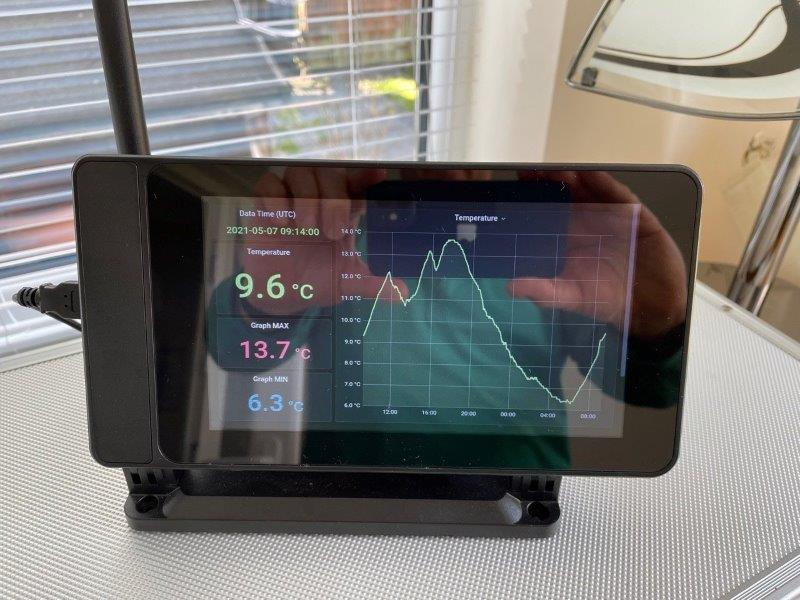
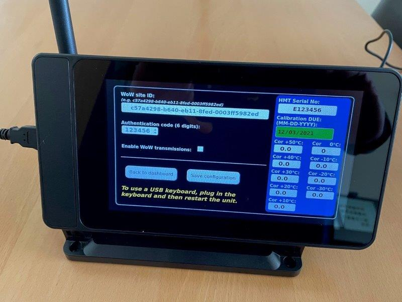

# **Met Office HMT333 temperature sensor data display unit.**

* [Introduction](#introduction)
* [Hardware requirements](#hardware-requirements)
* [Containerisation approach and tools](#containerisation-approach-and-tools)
* [Container notes](#container-notes)
* [Build time variables and secrets] 
* [Preparing a device image]
* [Developing locally]

### Introduction

---

This was originally based on the [balenaDash] project with the aim of providing a remote display and data 
unit for the [Vaisala HMT333] temperature sensor. A spread spectrum radio link
is established between the remote sensor, and the display unit using off the shelf
radio units. 

In addition to remotely displaying the current temperature, the unit
displays the latest MAX and MIN temperatures and regularly transmits temperature data to
the Met Office WoW system using a nearby WiFi (or ethernet) internet connection.

A settings page allows calibration details for the current sensor being used to be entered
along with WoW configuration information. A USB keyboard can be connected to help with
entering this information but note that the unit has to restarted after the keyboard has been 
connected before it can be used.

The unit runs a web page display in 'kiosk' mode, the only interaction with the unit
is via this web interface.

### Hardware requirements

---

* Raspberry Pi (minimum 1 GB RAM - Raspberry Pi 4 or higher recommended) with approved 
  power supply.
* Official Raspberry Pi 7 inch (ca. 18 cm) LCD touch screen panel.
* 16 GB (or greater) class 10 microSD card.
* Suitable case for the screen and Pi - ideally this case: [SmartPi pro]
* Campbell Scientific [RF422 radio unit] or similar (matching radio unit connected to the 
  HMT333 sensor in the distant enclosure).
  
### Containerisation approach and tools

---

The data display unit uses a [Docker] compatible software container approach in order to 
provide the required functional building blocks, separate containers are used for:

* Sensor data collection and processing.
* MetOffice WoW transmissions.
* Kiosk display.
* Dashboard web application.
* WiFi connection setup and monitoring.

The balena build system is used to build the individual containers using the free and
open source balena CLI utilities running within a local development mode. Note that the balena
dashboard facility is not used at this time. With the balena container development environment,
the developer is free to chose which parts he/she wishes to use. Most of these tools are free
and open source but dashboard monitoring is only available for free for up to 10 devices and
is a paid subscription service for subsequent devices.

The underlying operating system used on the Raspberry Pi is Balena OS which designed for
container use on embedded systems.

See the [balena] website for more details.

The balena command line interface (CLI) tools and instructions can be downloaded from here: [balena CLI]. On
Linux no installation is necessary, the unzipped files can be simply be placed in you Home directory 
or anywhere on your PATH. Note that certain commands require a local installation of Docker. If Docker 
cannot be installed then it may be necessary to use a 'dirty' laptop for e.g. building an image.

### Container notes

---

### _docker-compose.yml:_
This docker configuration file is used to configure and control the startup
of the different containers.

### _wifi-connect:_
This enables the device to operate as a WiFi access point and allow you to join 
a different WiFi network using captive portal functionality.

WiFi Connect periodically tests for a functional internet connection. If nothing is found, 
the device sets itself up as a WiFi access point named **_MET-OFF-HMT-DISPLAY_** that you can join 
with a mobile device or laptop.

To use WiFi Connect you need to join the **_MET-OFF-HMT-DISPLAY_** network, and you should see a 
captive portal popup. The passphrase is **_coldpinewater_**. If not, ensure that you 
remain connected to the **_MET-OFF-HMT-DISPLAY_** network and visit the IP address of the device 
in a browser on port 80. For example http://<ip of data display device>. This will 
allow you to access WiFi Connect, perform a site survey and join a different WiFi network.

The captive portal will list the locally available WiFi networks and allow you join one of them
which will then be used as the established internet connection.

### _kiosk:_
Sets up a kiosk mode user display using the builtin Chromium web browser as the user
interface.

### _metoffice-wow:_
Handles the scheduled transmission of data to the Met Office WoW network via the
WoW web API. A regular schedule is initially setup and then the latest temperature data 
is obtained from the running HMT333 container via an HTTP request.

### _hmt333:_
Listens for incoming data messages from the sensor via the radio=>USB port. If the
message is in the correct format, the temperature data is extracted (times are extracted
from the underlying Linux system time that is sync with an NTP server). A small internal
web server runs to answer requests from other containers for the latest temperature data.
Note that this web server is not accessible outside the container environment and is
only provided for internal container-to-container communications.

### _dashboard:_
This container runs a small Flask web application serving a main dashboard display page,
a settings page and 404/500 HTML error pages. The Flask application handles the 
populating of the web pages with the latest data and settings.

### _scheduler_
In the original project this was made available to provide a way schedule the switching
on and off od the display backlight at different times. It can still be used to this 
if required and for possible future scheduled tasks. It is not used to schedule WoW
messages (these are dealt with by the metoffice-wow container).

[balenaDash]: https://github.com/balenalabs/balena-dash
[SmartPi pro]: https://smarticase.com/products/smartipi-touch-pro?variant=33350872629311
[RF422 radio unit]: https://www.campbellsci.eu/rf422
[Vaisala HMT333]: https://www.vaisala.com/en/products/instruments-sensors-and-other-measurement-devices/instruments-industrial-measurements/hmt330
[Docker]: https://www.docker.com
[balena]: https://www.balena.io
[balena CLI]: https://github.com/balena-io/balena-cli/blob/master/INSTALL-LINUX.md
